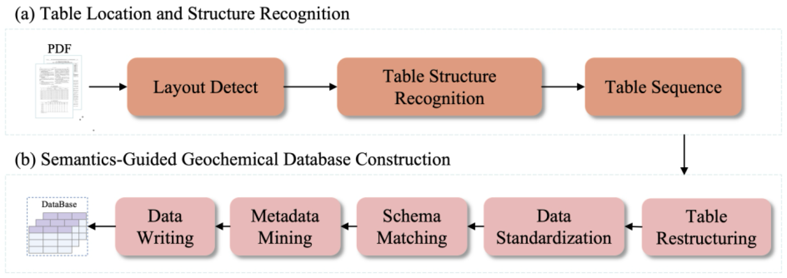
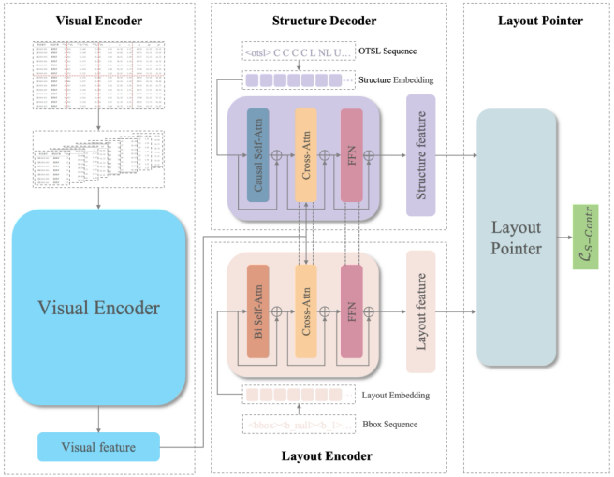

# Geochemical Literature Table Data Extraction via Multimodal and Large Language Model

This paper introduces an automated method that leverages multimodal representation learning and Large Language Models (LLMs) to extract table data from geochemical literature and facilitate subsequent database construction.





------

## Repository Structure

```text
.
├── assets/  
├── geotabunlocker/  
│   ├── configs/  
│   ├── data/
│   ├── excel_data/  
│   ├── geounlock/
│   ├── model/  
│   ├── output/ 
│   ├── admin.py  
│   ├── css.py 
│   ├── main.py  
│   ├── tool.py 
│   ├── utils.py 
├── TaBLIP/    
│   ├── configs/  
│   ├── data/
│   ├── dataset/
│   ├── models/  
│   ├── transform/
│   ├── eval_tablip.py  
│   ├── eval.ipynb 
│   ├── pretrain_tablip.py  
│   ├── posttrain_tablip.py 
│   ├── teds.py  
│   ├── utils.py 
├── .gitignore
├── LICENSE
├── requirements.txt 
└── README.md
```

------

## Workflow

#### Installation

1. Create a new conda environment

```bash
conda create -n geotabunlocker python=3.12
conda activate geotabunlocker
```

2. Clone the GeoTabUnlocker repository

```bash
git clone https://github.com/xxxxxx
```

3. Install packages

```bash
cd GeoTabUnlocker
pip install torch==2.7.0+cu128 torchmetrics==0.22.0+cu128 torchvision==6.5
pip install -r requirements.txt
```

#### Run GeoTabUnlocker

1. Download required model weights

To run the geotabunlocker correctly, you need to download the weights. You can find the TaBLIP model weights in this [link](https://pan.baidu.com/s/1b4Kxq3Ju-IIQcvWR6kRnsw?pwd=uzc4). And place the weight file in the `geotabunlocker/model` folder. At the same time, download the DocLayout-YOLO weights according to the downlink commands.

```bash
# DocLayout-YOLO
huggingface-cli download juliozhao/DocLayout-YOLO-DocLayNet-Docsynth300K_pretrained --local-dir ./geotabunlocker/model/bert-base-uncased --local-dir-use-symlinks False
```

2. Run

The following code runs GeoTabUnlocker. After the code runs successfully, you can enter http://localhost:7860/ in the browser to access the front-end interface.

```bash
python geotabunlocker/main.py
```

## TaBLIP Training & Evaluation

#### Training

1. Multimodal Representation Training

```bash
python pretrain_tablip.py \
	--config ./configs/pretrain.yaml \
  --output_dir ./output/tablip_pre/ \
  --device cuda \
  --distributed False \
```

The training results will be saved in the `./output/tablip_pre/` directory.

2. Structure Parsing Training

```bash
python posttrain_tablip.py \
  --config ./configs/posttrain.yaml \
  --output_dir ./output/tablip_post/ \
  --device cuda \
  --distributed False \
  --evaluate  \
  --checkpoint ./output/tablip_pre/checkpoint_xx.pth
```

The training results will be saved in the `./output/tablip_post/` directory.

#### Evaluation

1. Get evaluation results

```bash
python eval_tablip.py \
  --config ./configs/eval.yaml \
  --output_dir ./output/tablip_post/eval/ \
  --device cuda \
  --distributed False \
  --evaluate  \
  --checkpoint ./output/tablip_post/checkpoint_xx.pth
```

2. TEDS & S-TEDS

To obtain the TEDS and S-TEDS score, you need to run the `eval.ipynb`.

## Who do I talk to?

- Yan Gao, School of Artificial Intelligence, China University of Geosciences, Beijing 100083, China, ygao@email.cugb.edu.cn
- Xiaohui Ji, School of Artificial Intelligence, China University of Geosciences, Beijing 100083, China, xhji@cugb.edu.cn

## License

Copyright (C) 2021 Fabio Oriani This program is free software: you can redistribute it and/or modify it under the terms of the GNU General Public License as published by the Free Software Foundation, either version 3 of the License, or any later version. This program is distributed in the hope that it will be useful, but WITHOUT ANY WARRANTY; without even the implied warranty of MERCHANTABILITY or FITNESS FOR A PARTICULAR PURPOSE. See the GNU General Public License for more details. You should have received a copy of the GNU General Public License along with this program. If not, see [https://www.gnu.org/licenses/.](https://www.gnu.org/licenses/)
